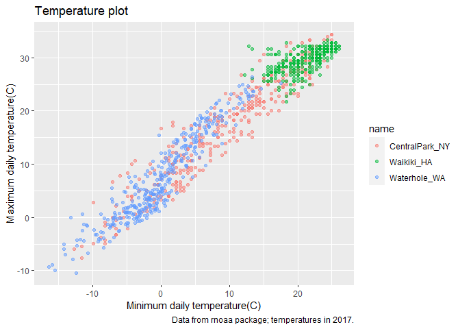
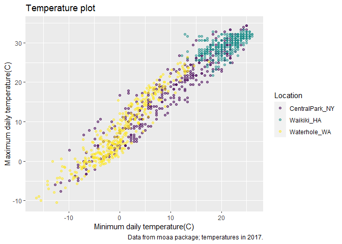
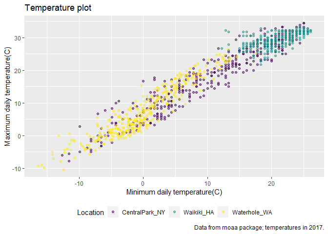
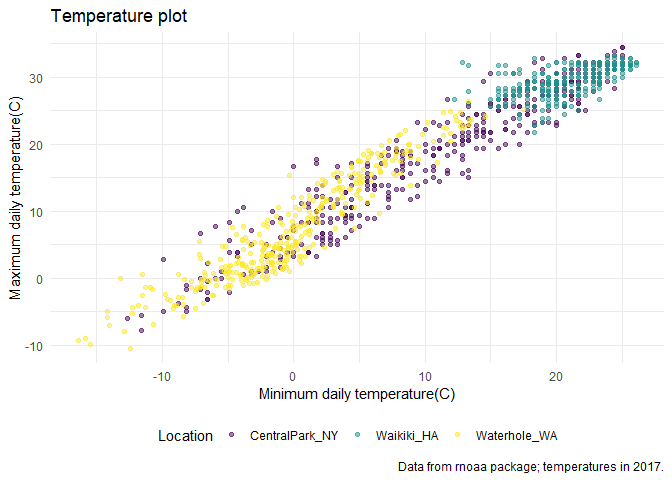
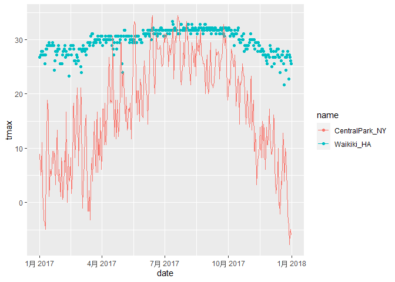
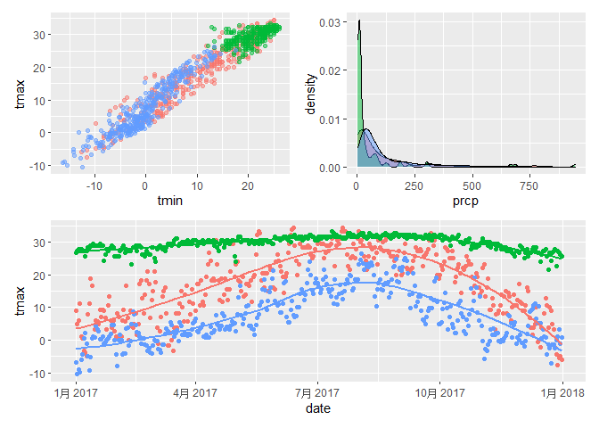
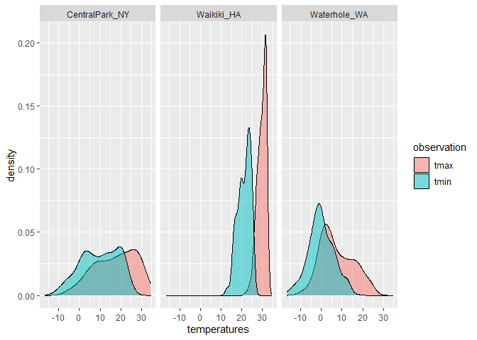
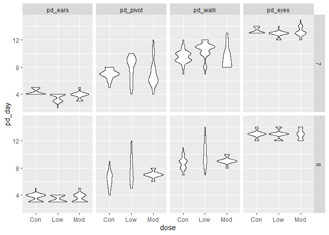

Visualization
================

``` r
library(tidyverse)
```

    ## ── Attaching packages ─────────────────────────────────────── tidyverse 1.3.2 ──
    ## ✔ ggplot2 3.3.6      ✔ purrr   0.3.4 
    ## ✔ tibble  3.1.8      ✔ dplyr   1.0.10
    ## ✔ tidyr   1.2.0      ✔ stringr 1.4.1 
    ## ✔ readr   2.1.2      ✔ forcats 0.5.2 
    ## ── Conflicts ────────────────────────────────────────── tidyverse_conflicts() ──
    ## ✖ dplyr::filter() masks stats::filter()
    ## ✖ dplyr::lag()    masks stats::lag()

``` r
library(patchwork)
```

## Load the weather data

``` r
weather_df = 
  rnoaa::meteo_pull_monitors(
    c("USW00094728", "USC00519397", "USS0023B17S"),
    var = c("PRCP", "TMIN", "TMAX"), 
    date_min = "2017-01-01",
    date_max = "2017-12-31") %>%
  mutate(
    name = recode(
      id, 
      USW00094728 = "CentralPark_NY", 
      USC00519397 = "Waikiki_HA",
      USS0023B17S = "Waterhole_WA"),
    tmin = tmin / 10,
    tmax = tmax / 10) %>%
  select(name, id, everything())
```

    ## Registered S3 method overwritten by 'hoardr':
    ##   method           from
    ##   print.cache_info httr

    ## using cached file: C:\Users\mahen\AppData\Local/Cache/R/noaa_ghcnd/USW00094728.dly

    ## date created (size, mb): 2022-10-11 21:30:48 (8.422)

    ## file min/max dates: 1869-01-01 / 2022-09-30

    ## using cached file: C:\Users\mahen\AppData\Local/Cache/R/noaa_ghcnd/USC00519397.dly

    ## date created (size, mb): 2022-10-11 21:30:59 (1.703)

    ## file min/max dates: 1965-01-01 / 2020-03-31

    ## using cached file: C:\Users\mahen\AppData\Local/Cache/R/noaa_ghcnd/USS0023B17S.dly

    ## date created (size, mb): 2022-10-11 21:31:04 (0.954)

    ## file min/max dates: 1999-09-01 / 2022-10-31

``` r
weather_df
```

    ## # A tibble: 1,095 × 6
    ##    name           id          date        prcp  tmax  tmin
    ##    <chr>          <chr>       <date>     <dbl> <dbl> <dbl>
    ##  1 CentralPark_NY USW00094728 2017-01-01     0   8.9   4.4
    ##  2 CentralPark_NY USW00094728 2017-01-02    53   5     2.8
    ##  3 CentralPark_NY USW00094728 2017-01-03   147   6.1   3.9
    ##  4 CentralPark_NY USW00094728 2017-01-04     0  11.1   1.1
    ##  5 CentralPark_NY USW00094728 2017-01-05     0   1.1  -2.7
    ##  6 CentralPark_NY USW00094728 2017-01-06    13   0.6  -3.8
    ##  7 CentralPark_NY USW00094728 2017-01-07    81  -3.2  -6.6
    ##  8 CentralPark_NY USW00094728 2017-01-08     0  -3.8  -8.8
    ##  9 CentralPark_NY USW00094728 2017-01-09     0  -4.9  -9.9
    ## 10 CentralPark_NY USW00094728 2017-01-10     0   7.8  -6  
    ## # … with 1,085 more rows

## Remember this plot?

``` r
weather_df %>%
  ggplot(aes(x = tmin, y = tmax, color = name)) +
  geom_point(alpha = .5)
```

    ## Warning: Removed 15 rows containing missing values (geom_point).

<!-- -->

## Labels

``` r
weather_df %>%
  ggplot(aes(x = tmin, y = tmax, color = name)) +
  geom_point(alpha = .5) +
  labs(
    title = "Temperature plot",
    x = "Minimum daily temperature(C)",
    y = "Maximum daily temperature(C)",
    caption = "Data from rnoaa package; temperatures in 2017."
  )
```

    ## Warning: Removed 15 rows containing missing values (geom_point).

<!-- -->

## Scales

Start with the same plot; x and y scales.

trans = “sqrt”/“log”… position = “right”

``` r
weather_df %>%
  ggplot(aes(x = tmin, y = tmax, color = name)) +
  geom_point(alpha = .5) +
  labs(
    title = "Temperature plot",
    x = "Minimum daily temperature(C)",
    y = "Maximum daily temperature(C)",
    caption = "Data from rnoaa package; temperatures in 2017."
  ) +
  scale_x_continuous(
    breaks = c(-15, 0, 15),
    labels = c("-15 C", "0", "15")
  ) +
  scale_y_continuous(
    position = "right"
  )
```

    ## Warning: Removed 15 rows containing missing values (geom_point).

<!-- -->

Look at color scales.

Change color by creating your own color palettes.

``` r
weather_df %>%
  ggplot(aes(x = tmin, y = tmax, color = name)) +
  geom_point(alpha = .5) +
  labs(
    title = "Temperature plot",
    x = "Minimum daily temperature(C)",
    y = "Maximum daily temperature(C)",
    caption = "Data from rnoaa package; temperatures in 2017."
  ) +
  scale_color_hue(
    name = "Location",
    h = c(100, 300))
```

    ## Warning: Removed 15 rows containing missing values (geom_point).

<!-- -->

Use `viridis` to change color is better.

``` r
weather_df %>%
  ggplot(aes(x = tmin, y = tmax, color = name)) +
  geom_point(alpha = .5) +
  labs(
    title = "Temperature plot",
    x = "Minimum daily temperature(C)",
    y = "Maximum daily temperature(C)",
    caption = "Data from rnoaa package; temperatures in 2017."
  ) +
  viridis::scale_color_viridis(
    name = "Location",
    discrete = TRUE)
```

    ## Warning: Removed 15 rows containing missing values (geom_point).

<!-- -->

## Themes

shift the legend.

``` r
weather_df %>%
  ggplot(aes(x = tmin, y = tmax, color = name)) +
  geom_point(alpha = .5) +
  labs(
    title = "Temperature plot",
    x = "Minimum daily temperature(C)",
    y = "Maximum daily temperature(C)",
    caption = "Data from rnoaa package; temperatures in 2017."
  ) +
  viridis::scale_color_viridis(
    name = "Location",
    discrete = TRUE) +
  theme(legend.position = "bottom")
```

    ## Warning: Removed 15 rows containing missing values (geom_point).

<!-- -->

Change the overall theme.

theme_bw(), theme_minimal(), theme_classic() …

ggthemes::theme\_ …

``` r
weather_df %>%
  ggplot(aes(x = tmin, y = tmax, color = name)) +
  geom_point(alpha = .5) +
  labs(
    title = "Temperature plot",
    x = "Minimum daily temperature(C)",
    y = "Maximum daily temperature(C)",
    caption = "Data from rnoaa package; temperatures in 2017."
  ) +
  viridis::scale_color_viridis(
    name = "Location",
    discrete = TRUE) +
  theme_minimal() +
  theme(legend.position = "bottom")
```

    ## Warning: Removed 15 rows containing missing values (geom_point).

<!-- -->

## Setting options

Always put on the top of the document.

``` r
lobrarry(tidyverse)

knitr::opts_chunk$set(
  fig.width = 6,
  fig.asp = .6,
  out.width = "90%"
)

theme_set(theme_minimal() + theme(legend.position = "bottom"))

options(
  ggplot2.continuous.color = "viridis",
  ggplot2.continuous.fill = "viridis"
)

scale_color_discrete = scale_color_viridis_d
scale_fill_discrete = scale_fill_viridis_d
```

## Data args in `geom`

``` r
central_park =
  weather_df %>%
  filter(name == "CentralPark_NY")

waikiki =
  weather_df %>%
  filter(name == "Waikiki_HA")

ggplot(data = waikiki, aes(x = date, y = tmax, color = name)) +
  geom_point() +
  geom_line(data = central_park)
```

    ## Warning: Removed 3 rows containing missing values (geom_point).

<!-- -->

## `patchwork`

remember faceting?

``` r
weather_df %>%
  ggplot(aes(x = tmin, fill = name)) +
  geom_density(alpha = .5) +
  facet_grid(. ~ name)
```

    ## Warning: Removed 15 rows containing non-finite values (stat_density).

<!-- -->

what happens when you want multipanel plots but can’t facet …?

``` r
tmax_tmin_plot = 
  weather_df %>%
  ggplot(aes(x = tmin, y = tmax, color = name)) +
  geom_point(alpha = .5) +
  theme(legend.position = "none")

prcp_dens_plot =
  weather_df %>%
  filter(prcp > 0) %>%
  ggplot(aes(x = prcp, fill = name)) +
  geom_density(alpha = .5) +
   theme(legend.position = "none")

tmax_date_plot = 
  weather_df %>%
  ggplot(aes(x = date, y = tmax, color = name)) +
  geom_point() +
  geom_smooth(se = FALSE) +
  theme(legend.position = "none")

(tmax_tmin_plot + prcp_dens_plot) / tmax_date_plot
```

    ## Warning: Removed 15 rows containing missing values (geom_point).

    ## `geom_smooth()` using method = 'loess' and formula 'y ~ x'

    ## Warning: Removed 3 rows containing non-finite values (stat_smooth).

    ## Warning: Removed 3 rows containing missing values (geom_point).

<!-- -->

## Data manipulation

Control your factors.

forcats::fct_relevel(name,…) reorder the variable name.

``` r
weather_df %>%
  mutate(
    name = factor(name),
    name = forcats::fct_relevel(name, c("Waikiki_HA"))
  ) %>%
  ggplot(aes(x = name, y = tmax, fill = name)) +
  geom_violin(alpha = .5)
```

    ## Warning: Removed 3 rows containing non-finite values (stat_ydensity).

<!-- -->

What if I wanted densities for tmin and tmax simultaneously?

``` r
weather_df %>%
  pivot_longer(
    tmax:tmin,
    names_to = "observation",
    values_to = "temperatures"
  ) %>%
  ggplot(aes(x = temperatures, fill = observation)) +
  geom_density(alpha = .5) +
  facet_grid(. ~ name)
```

    ## Warning: Removed 18 rows containing non-finite values (stat_density).

<!-- -->

## Revisit the pups

Data from the FAS study.

``` r
pup_data = 
  read_csv("./data/FAS_pups.csv") %>%
  janitor::clean_names() %>%
  mutate(sex = recode(sex, `1` = "male", `2` = "female"))
```

    ## Rows: 313 Columns: 6
    ## ── Column specification ────────────────────────────────────────────────────────
    ## Delimiter: ","
    ## chr (1): Litter Number
    ## dbl (5): Sex, PD ears, PD eyes, PD pivot, PD walk
    ## 
    ## ℹ Use `spec()` to retrieve the full column specification for this data.
    ## ℹ Specify the column types or set `show_col_types = FALSE` to quiet this message.

``` r
litters_data =
  read_csv("./data/FAS_litters.csv") %>%
  janitor::clean_names() %>%
  separate(group, into = c("dose", "day_tx"), sep = 3)
```

    ## Rows: 49 Columns: 8
    ## ── Column specification ────────────────────────────────────────────────────────
    ## Delimiter: ","
    ## chr (2): Group, Litter Number
    ## dbl (6): GD0 weight, GD18 weight, GD of Birth, Pups born alive, Pups dead @ ...
    ## 
    ## ℹ Use `spec()` to retrieve the full column specification for this data.
    ## ℹ Specify the column types or set `show_col_types = FALSE` to quiet this message.

``` r
fas_data = left_join(pup_data, litters_data, by = "litter_number")


fas_data %>%
  select(dose, day_tx, starts_with("pd_")) %>%
  pivot_longer(
    pd_ears:pd_walk,
    names_to = "outcome",
    values_to = "pd_day"
  ) %>%
  drop_na() %>%
  mutate(outcome = forcats::fct_relevel(outcome, "pd_ears", "pd_pivot", "pd_walk", "pd_eyes")) %>%
  ggplot(aes(x = dose, y = pd_day)) +
  geom_violin() +
  facet_grid(day_tx ~ outcome)
```

<!-- -->
